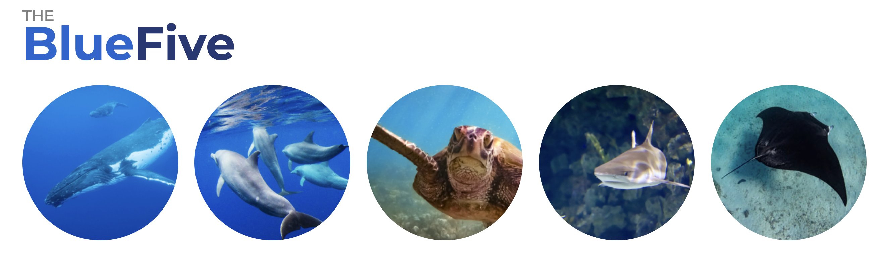

::: top-banner
:::

# Workshop overview

The objective of this workshop is to bring together regional experts and international collaborators to advance the implementation of the Save the Blue Five project, an initiative funded by IKI focused on the conservation of marine megafauna in the Eastern Tropical Pacific. The project focuses on whales, dolphins, sharks, rays, and sea turtles, ecologically important species facing increasing threats from both human pressures and climate change.

The workshop is structured as a progressive process that integrates scientific advances, model development, and practical applications. Throughout the sessions, participants will review the current state of knowledge, including biological datasets, species distribution models, and climate projections, as well as recent developments in oceanographic modeling and downscaling approaches.

Building on this foundation, the workshop aims to align technical capacity with regional needs, identifying which results are both feasible and useful for decision-making. This includes assessing climate vulnerability, identifying priority areas for conservation, and exploring approaches that account for dynamic ocean processes and the highly migratory nature of these species.

Finally, the workshop places a strong emphasis on defining concrete outputs and a clear roadmap for the next phase of the project. The goal is to strengthen collaboration, define research priorities, and develop scientific and applied products that can directly support marine spatial planning, regional coordination, and long-term biodiversity conservation in the Eastern Tropical Pacific.

```{r, out.width = "100%", echo = FALSE}
  
```

## Location and dates

- San Cristobal Island, Galápagos
- June 8 to June 12, 2026

## Workshop guidelines and confidentiality

We aim for this workshop to be a space for open and transparent discussion. All conversations will follow the Chatham House Rule. If you choose to use social media, we ask that you remain mindful of the sensitivity of the topics discussed and be selective about what you share.

If you are presenting and prefer that your material is not shared on social media, please make this clear at the beginning of your presentation or in your slides.

::: {.callout-caution collapse="true" title="Chatham House Rule"}
*"When a meeting, or part of it, is held under the Chatham House Rule, participants are free to use the information received, but neither the identity nor the affiliation of the speaker, nor that of any other participant, may be revealed."*
:::

## Acknowledgements

The [Moore Center for Science and Solutions](https://www.conservation.org/about/betty-and-gordon-moore-center-for-science-and-solutions) of [Conservation International](https://www.conservation.org/) acknowledges the support of the German Government through the IKI program, as well as the consortium partners involved in the [Save the Blue Five](https://savethebluefive.net/) project (CPPS, GIZ, and MarViva) for making this workshop possible.
