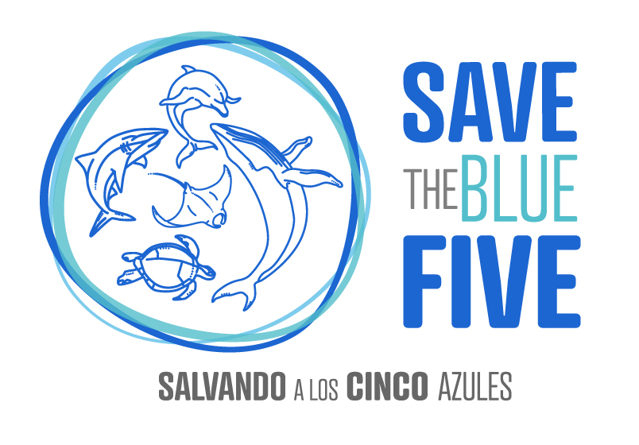
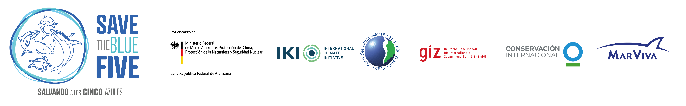

::: top-banner
:::

::: {.lang-switch}
[EN](01_home.qmd) <span class="active-lang">ES</span>
:::

::: {.home-hero}
::: {.home-hero-title}
<span class="hero-line">Megafauna Marina</span><span class="hero-line">y Modelación del Cambio Climático</span><span class="hero-line">Taller</span>
:::

::: {.home-subtitle}
Save the Blue Five | Santa Cruz, Galápagos | 8-12 de junio de 2026
:::

{.hero-logo}
:::

## Descripción general del taller

El objetivo de este taller es reunir a expertos regionales y colaboradores internacionales para avanzar en la implementación del proyecto Save the Blue Five, una iniciativa financiada por IKI y enfocada en la conservación de la megafauna marina en el Pacífico Tropical Oriental. El proyecto se centra en ballenas, delfines, tiburones, rayas y tortugas marinas, especies ecológicamente importantes que enfrentan amenazas crecientes tanto por presiones humanas como por el cambio climático.

El taller está estructurado como un proceso progresivo que integra avances científicos, desarrollo de modelos y aplicaciones prácticas. A lo largo de las sesiones, los participantes revisarán el estado actual del conocimiento, incluidos los conjuntos de datos biológicos, los modelos de distribución de especies y las proyecciones climáticas, así como los avances recientes en modelación oceanográfica y enfoques de downscaling.

Sobre esta base, el taller busca alinear la capacidad técnica con las necesidades regionales, identificando qué resultados son tanto viables como útiles para la toma de decisiones. Esto incluye evaluar la vulnerabilidad al cambio climático, identificar áreas prioritarias para la conservación y explorar enfoques que consideren los procesos oceánicos dinámicos y la naturaleza altamente migratoria de estas especies.

Finalmente, el taller pone un fuerte énfasis en definir productos concretos y una hoja de ruta clara para la siguiente fase del proyecto. El objetivo es fortalecer la colaboración, definir prioridades de investigación y desarrollar productos científicos y aplicados que puedan apoyar directamente la planificación espacial marina, la coordinación regional y la conservación de la biodiversidad a largo plazo en el Pacífico Tropical Oriental.

```{r, out.width = "100%", echo = FALSE, fig.class="home-cover"}
  
```

## Lugar y fechas

- Isla Santa Cruz, Galápagos
- Del 8 al 12 de junio de 2026

## Lineamientos del taller y confidencialidad

Buscamos que este taller sea un espacio de discusión abierta y transparente. Todas las conversaciones seguirán la Regla de Chatham House. Si decide utilizar redes sociales, le pedimos que tenga en cuenta la sensibilidad de los temas discutidos y sea selectivo con lo que comparte.

Si va a presentar y prefiere que su material no sea compartido en redes sociales, por favor indíquelo claramente al inicio de su presentación o en sus diapositivas.

::: {.callout-caution collapse="true" title="Regla de Chatham House"}
*"Cuando una reunión, o parte de ella, se realiza bajo la Regla de Chatham House, los participantes pueden usar la información recibida, pero no pueden revelar ni la identidad ni la afiliación del orador, ni la de ningún otro participante."*
:::

## Agradecimientos

El <a href="https://www.conservation.org/about/betty-and-gordon-moore-center-for-science-and-solutions" target="_blank" rel="noopener noreferrer">Moore Center for Science and Solutions</a> de <a href="https://www.conservation.org/" target="_blank" rel="noopener noreferrer">Conservation International</a> agradece el apoyo del Gobierno de Alemania a través del programa IKI, así como de los socios del consorcio involucrados en el proyecto <a href="https://savethebluefive.net/" target="_blank" rel="noopener noreferrer">Save the Blue Five</a> (CPPS, GIZ y MarViva) por hacer posible este taller.
