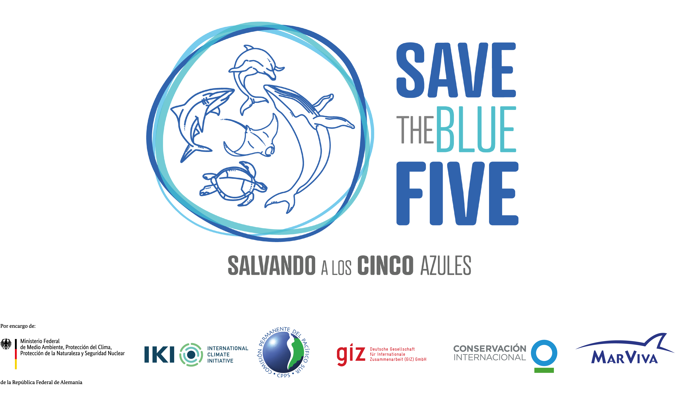

::: top-banner
:::

::: {.lang-switch}
[EN](index.qmd) ES
:::

::: {.front-landing}
::: {.front-hero-title .spanish-hero-title}
Taller de Megafauna Marinay Modelación Climática
:::

::: {.front-subtitle}
Save the Blue Five | Santa Cruz, Galápagos | 8-12 de junio de 2026
:::

{.front-logo}
:::

::: {.site-counter}
**Visitas a la página principal:** 
:::
